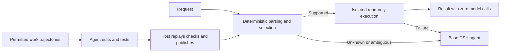

# Self-evolving Router for DSH

**English** | [简体中文](README.zh-CN.md)

[](https://github.com/sra-research/self-evolving-router-dsh/actions/workflows/ci.yml)

Run deterministic programs before DeepSeek Harness calls a model. Unsupported, ambiguous or failed requests fall back to the base agent. The agent can use permitted work trajectories to edit, test and persistently publish these programs.

**Research alpha · Current entry point: v2 · Automated execution is limited to read-only public files.** Continuous-context capability development has been demonstrated; broad reliability and net lifecycle cost savings have not. This is an independent project, not an official DeepSeek plugin.

Find all guides in the [documentation index](docs/README.md). Each guide's language is listed there.

## How it works



Routing makes no model calls; development uses your configured model. Passing agent-written tests is development evidence, not independent correctness certification. **Current v2 learning requires an explicit development or training run. Ordinary requests do not start background training.**

## Quick start: no API required

Requirements: Node.js 22+, npm and running Docker. DSH is pinned to `0.1.0-rc.6`; the lockfile fixes dependencies. Run from a fresh clone:

```sh
git clone https://github.com/sra-research/self-evolving-router-dsh.git
cd self-evolving-router-dsh
npm ci
node install.js
docker pull python@sha256:9d2e5553305c7c7b0097999bb17187c69b921ccd6bc9d40e4bb5ebe652c00285
npm run doctor
mkdir -p .sandbox/demo-v2 .sandbox/snapshots-v2
printf 'hello\nworld\n' > .sandbox/demo-v2/example.php
node v2.js init .sandbox/demo-v2 .sandbox/snapshots-v2
node v2.js route .sandbox/demo-v2 "Count total lines in PHP files in /testbed"
node v2.js status .sandbox/demo-v2
```

Expect `"kind": "completed"`, `"text": "2\n"` and `"modelCalls": 0`. The direct `route` command returns fallback JSON for unsupported requests; it never calls a model. Use `node run.js` for the full agent; see [getting started (中文)](docs/getting-started.md).

For Colima, first set `export DOCKER_CONTEXT=colima` and `export ROUTER_DOCKER_CONTEXT=colima`. Otherwise the configured Docker context is used; `ROUTER_DOCKER_CONTEXT` can override it. Both directories must be shared with Docker, and snapshots must live outside the task directory. Initialization refuses to overwrite an existing registry; use fresh directories when repeating the example.

## From routing to learning

| Purpose | Guide |
| --- | --- |
| Installation, full DSH and API configuration | [Getting started · 中文](docs/getting-started.md) |
| Environment checks and common errors | `npm run doctor` · [Troubleshooting · 中文](docs/troubleshooting.md) |
| Capability packages, development, publication and rollback | [v2 design · 中文](docs/autonomous-v2.md) |
| Continuous tasks and agent-chosen development timing | [Training experiment · English](docs/continuous-training.md) |
| Evidence and limitations | [Results · 中文](docs/results.md) |
| Previous cli.js evolve workflow | [Archived v1 guide · 中文](docs/archive/legacy-rule-objects.md) |

The initial v2 package only lists files and counts newline characters. File, byte and word counts learned in experiments are not built in. v1 and v2 use different state, history and maintenance interfaces; use the guide for your backend.

## Current experiment

After 24 training tasks in one context, the guided autonomous agent chose to develop in one batch:

| Condition | Training model calls | Training tokens | Correct frozen automation |
| --- | ---: | ---: | ---: |
| Fixed batches | 96 | 2,944,523 | 12/12 |
| Guided, agent-chosen timing | 87 | 1,116,190 | 12/12 |

This is one development comparison across six read-only counting operations, authored requests and modified file environments. It is not an official InterCode score, a sealed test or evidence of broad coding competence. Reuse in this run did not amortize learning costs. Earlier failures and repaired reruns remain in the [results summary (中文)](docs/results.md).

## Development and contributions

```sh
npm run check
npm test
```

Default tests skip opt-in Docker/profile integration checks; skips are not passes. Full commands are in [Contributing](CONTRIBUTING.md). Tests use offline model substitutes; live scripts and real benchmarks call APIs and must be started explicitly.

Installation reports, boundary failures, minimal reproductions and documentation improvements are welcome. See [execution boundaries](docs/BOUNDARIES.md), [security](SECURITY.md), [changelog](CHANGELOG.md) and [third-party notices](THIRD_PARTY_NOTICES.md). [MIT license](LICENSE).
