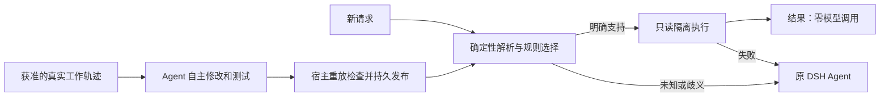

# Self-evolving Router for DSH

[English](README.md) | **简体中文**

[](https://github.com/sra-research/self-evolving-router-dsh/actions/workflows/ci.yml)

在 DeepSeek Harness 调用模型之前，用确定性程序完成可明确处理的请求；未知、歧义或执行失败时回退到原 Agent。Agent 可以从真实工作轨迹中修改、测试和持久发布这些程序。

**研究型 alpha · 当前入口为 v2 · 自动执行限于只读公开文件。** 已验证连续上下文中的自主开发闭环，尚未证明普遍可靠或全生命周期净降本。不是 DeepSeek 官方插件，也不承诺安装后自动学会所有任务。

完整文档导航见 [文档索引](docs/README.zh-CN.md)。技术文档的语言在索引中注明。

## 它怎么工作



路由本身不调用模型，开发会调用你配置的模型。Agent 自写测试通过是开发证据，不等于独立正确性认证。**当前 v2 学习需要显式启动开发或训练流程，普通请求不会自动开启后台训练。**

## 快速开始：不需要 API

准备 Node.js 22+（含 npm）和已启动的 Docker，然后运行：

```sh
git clone https://github.com/sra-research/self-evolving-router-dsh.git
cd self-evolving-router-dsh
npm run demo
```

Demo 自动检查 Docker，首次按需下载固定镜像，创建独立示例目录，初始化能力并执行请求。成功时显示 **`2 lines · 0 model calls`**。可以重复运行，每次使用新的 `.sandbox/demo-*` 目录，不覆盖已有任务。

这个确定性示例无需 `npm ci`、DSH profile 或 API。Colima 如未设为默认 context，可使用 `ROUTER_DOCKER_CONTEXT=colima npm run demo`。仓库目录需可被 Docker 共享。完整 Agent 接入与手动命令见 [开始使用](docs/getting-started.md)。

## 从试用到学习

| 目的 | 入口 |
| --- | --- |
| 安装、完整 DSH、API 配置 | [开始使用](docs/getting-started.md) |
| 环境诊断与常见错误 | `npm run doctor` · [排障](docs/troubleshooting.md) |
| 能力包、开发工具、发布与回滚 | [v2 设计](docs/autonomous-v2.md) |
| 连续做题与自主开发时机实验 | [训练实验](docs/continuous-training.md) |
| 当前证据及结论边界 | [实验结果](docs/results.md) |
| 原有 cli.js evolve 流程 | [历史 v1 指南](docs/archive/legacy-rule-objects.md) |

初始 v2 能力只有文件列表和换行符统计。实验中新学到的文件数、字节数、词数等能力不是默认内置功能。v1/v2 状态、历史接口和维护工具不同，请勿混用操作手册。

## 当前实验表现

同一上下文的 24 道训练题后，引导自主组自行选择集中开发：

| 条件 | 训练模型调用 | 训练 token | 冻结正确自动化 |
| --- | ---: | ---: | ---: |
| 固定批次 | 96 | 2,944,523 | 12/12 |
| 引导后自主时机 | 87 | 1,116,190 | 12/12 |

这是六类只读计数操作、人工请求和修改文件环境上的单次开发比较，不是官方 InterCode 分数、sealed 测试或广泛 coding 能力证明。学习成本尚未由本轮复用摊回。早期失败与修复重跑也保留在 [结果说明](docs/results.md)。

## 开发与贡献

```sh
npm run check
npm test
```

默认测试跳过需要 Docker/profile 的集成项，跳过不算通过。完整命令见 [贡献说明](CONTRIBUTING.md)。测试套件使用离线模型替身；live 脚本和真实 benchmark 会调用 API，须显式启动。

欢迎提交安装失败、边界错误、最小复现和文档改进。另见 [执行边界](docs/BOUNDARIES.md)、[安全说明](SECURITY.md)、[变更记录](CHANGELOG.md)、[第三方声明](THIRD_PARTY_NOTICES.md)。[MIT 许可](LICENSE)。
